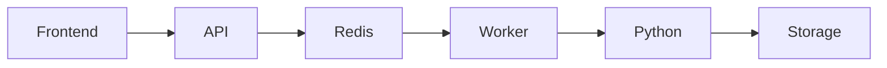

# 3D Room Platform Monorepo

Production-minded monorepo bootstrap for a 3D rendering e-commerce flow.

## Architecture

This project implements a distributed async rendering pipeline. The system is composed of independent API, Worker, Queue, and Database layers, each with a well-defined responsibility. The design follows production patterns while remaining simple enough for an MVP.



### Documentation

- [System Overview](docs/architecture/01-overview.md)
- [API Layer](docs/architecture/02-api.md)
- [Worker Layer](docs/architecture/03-worker.md)
- [Queue Layer](docs/architecture/04-queue.md)
- [Database Layer](docs/architecture/05-database.md)

### Why This Architecture

- Demonstrates async processing patterns with decoupled producers and consumers
- Shows clear separation of concerns across independently deployable services
- Designed for horizontal scalability at the worker tier
- Simplified for MVP while preserving production-grade patterns

### Service Overview

- `apps/web`: Next.js UI that submits render jobs and polls for completion.
- `apps/api`: Express API that persists requests and enqueues async jobs.
- `apps/worker`: BullMQ worker that calls the Python renderer and updates job state.
- `services/renderer`: Blender-compatible Python renderer script.
- `packages/types`: Shared TypeScript contracts.
- `packages/db`: Prisma schema + client wrapper.
- `packages/queue`: Shared BullMQ queue and Redis connection config.

## Folder Structure

```text
.
├── apps
│   ├── api
│   │   ├── package.json
│   │   ├── src
│   │   │   └── index.ts
│   │   └── tsconfig.json
│   ├── web
│   │   ├── app
│   │   │   ├── globals.css
│   │   │   ├── layout.tsx
│   │   │   └── page.tsx
│   │   ├── next-env.d.ts
│   │   ├── next.config.mjs
│   │   ├── package.json
│   │   └── tsconfig.json
│   └── worker
│       ├── package.json
│       ├── src
│       │   └── index.ts
│       └── tsconfig.json
├── docker-compose.yml
├── package.json
├── packages
│   ├── db
│   │   ├── package.json
│   │   ├── prisma
│   │   │   └── schema.prisma
│   │   ├── src
│   │   │   ├── client.ts
│   │   │   └── index.ts
│   │   └── tsconfig.json
│   ├── queue
│   │   ├── package.json
│   │   ├── src
│   │   │   └── index.ts
│   │   └── tsconfig.json
│   └── types
│       ├── package.json
│       ├── src
│       │   └── index.ts
│       └── tsconfig.json
├── pnpm-workspace.yaml
├── services
│   └── renderer
│       ├── output
│       └── render.py
└── tsconfig.base.json
```

## Prerequisites

- **For Docker**: Docker Engine + Docker Compose
- **For local dev**: Node.js 20+, pnpm 9+
- **Python** (in Docker): Included in worker container image
- **Blender** (optional): Script has mock PNG fallback for testing

## Quick Start with Docker

The simplest way to run the full system:

```bash
pnpm docker:up
```

This builds and starts all services (postgres, redis, api, worker, web).

On first run, apply the database migration:

```bash
docker compose exec api pnpm --filter @repo/db db:deploy
```

Verify the system is working:

```bash
# Check API health
curl http://localhost:4000/health

# Create a render job
curl -X POST http://localhost:4000/render \
  -H 'Content-Type: application/json' \
  -d '{"items":[{"sku":"chair","quantity":1}]}'

# Poll job status (returns pending → processing → done)
curl http://localhost:4000/render/<id>

# View rendered image (once status is done)
curl http://localhost:4000/render/<id>/image --output render.png
```

Open http://localhost:3000 to see the web UI. Click "Generate Room" to trigger a render job and watch the image appear.

To stop all services:

```bash
pnpm docker:down
```

## Local Development

For iterative development without Docker:

### Setup

1. Install dependencies:
   ```bash
   pnpm install
   ```

2. Start infrastructure (Postgres + Redis only):
   ```bash
   docker compose up postgres redis -d
   ```

3. Run database migrations:
   ```bash
   pnpm db:migrate
   ```

### Run Services

In separate terminals:

```bash
pnpm dev:api    # Express API on port 4000
pnpm dev:worker # BullMQ worker
pnpm dev:web    # Next.js UI on port 3000
```

## API Endpoints

- `GET /health` — health check
- `POST /render` — create render job (accepts `{ items: Array<{sku, quantity, color?}> }`)
- `GET /render/:id` — get job status (returns `{ id, status, items, imageUrl, createdAt }`)
- `GET /render/:id/image` — download rendered PNG image

## System Flow

1. User clicks "Generate Room" button on web UI (http://localhost:3000)
2. Web calls `POST /render` with room composition (furniture items)
3. API creates Render record in Postgres with status `pending`
4. API enqueues job to BullMQ Redis queue
5. Worker picks up job, updates status to `processing`
6. Worker spawns Python renderer (mock: generates tiny PNG; real: uses Blender)
7. Worker updates Render record: status → `done`, stores image URL
8. Web UI polls `GET /render/:id` and detects completion
9. Web fetches image via `GET /render/:id/image` and displays it

## Design Notes

- **Async Processing**: BullMQ isolates slow rendering from HTTP handlers, enabling independent API/Worker scaling
- **Mock Renderer**: Python fallback generates valid PNG when Blender unavailable (no external dependencies needed for demo)
- **Structured Logging**: JSON-formatted logs on API/Worker for observability
- **Retry Strategy**: Worker uses 3-attempt exponential backoff (2s initial delay) before marking job failed
- **Shared Volume**: Rendered images stored in Docker volume accessible to both API and Worker containers

## Troubleshooting

**Services won't start?** Check Docker daemon is running: `docker ps`

**Migration fails?** Ensure postgres is healthy before running: `docker compose up postgres -d && sleep 5`

**Image endpoint 404?** Render job must complete first. Check `GET /render/:id` status is `done`.

**Port conflicts?** Change ports in `docker-compose.yml` if 3000/4000 are in use locally.
