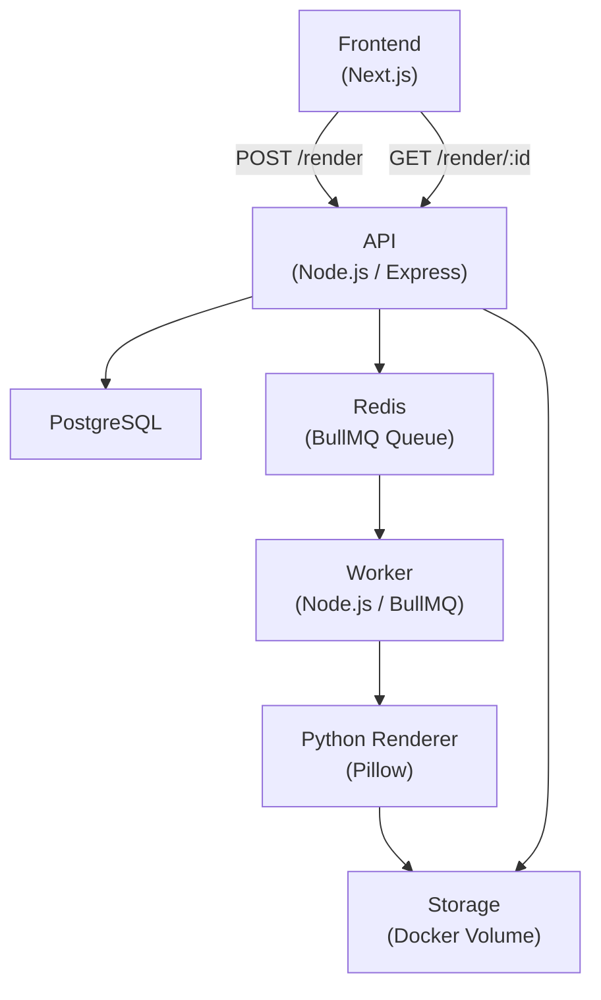
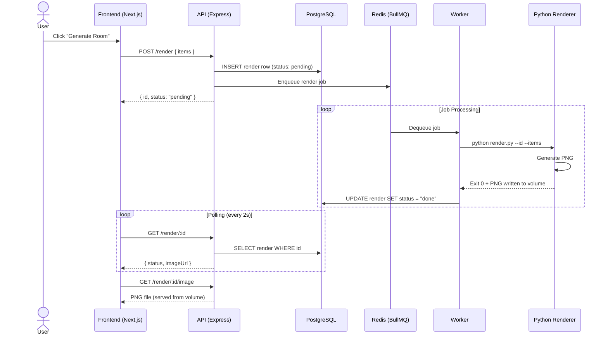

# System Architecture Overview

## Description

This system implements a distributed asynchronous rendering pipeline for 3D room visualization. When a user triggers a render request from the frontend, the API layer persists the job metadata to PostgreSQL and enqueues it to a Redis-backed queue. A dedicated worker process consumes jobs independently from the API, delegating image generation to a Python renderer powered by Pillow. The generated PNG is written to a shared storage volume, which the API then serves back to the frontend. The frontend polls for job completion and displays the result once available.

---

## High-Level Architecture

---

## Request Lifecycle

---

## Key Architectural Decisions

### Async Processing
Rendering is CPU-bound and can take several seconds. Processing it synchronously inside the API would block the event loop and degrade all concurrent requests. Offloading to a background worker keeps the API fast and responsive.

### Redis Queue (BullMQ)
A queue decouples job submission from job execution. It provides built-in retry logic, exponential backoff, and job persistence across restarts — all critical for a reliable pipeline without custom retry infrastructure.

### Worker Separated from API
The worker runs as an independent process with its own lifecycle. This allows independent scaling, isolated failure domains, and the ability to add GPU or CPU-heavy dependencies to the worker container without impacting the API image.

### Shared Volume for Storage (MVP)
Using a Docker-managed volume for PNG output avoids introducing object storage dependencies (e.g., S3) at MVP stage. Both the worker (write) and API (read/serve) containers mount the same volume, keeping the architecture simple and infrastructure-free for local development.
