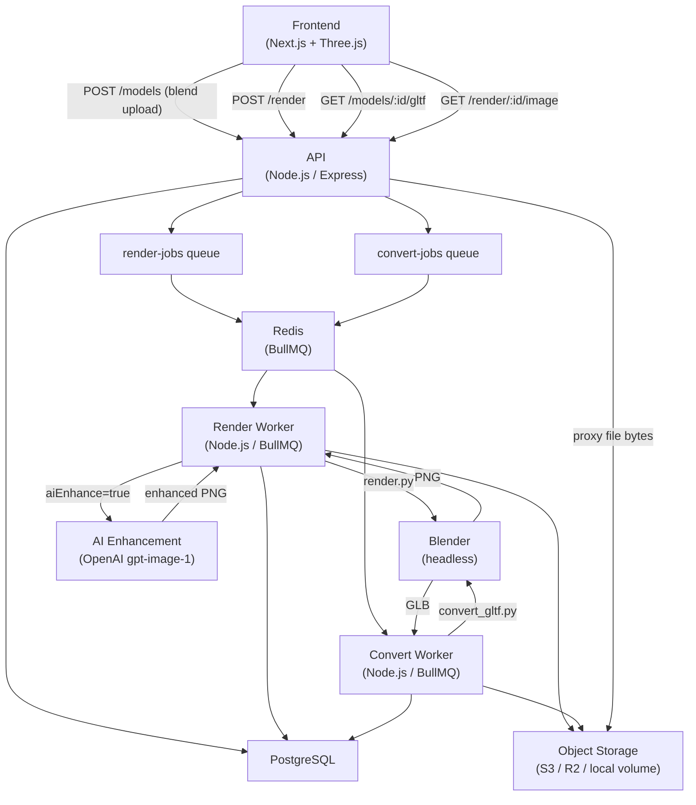
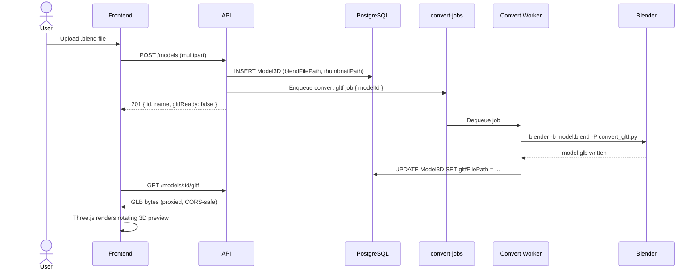
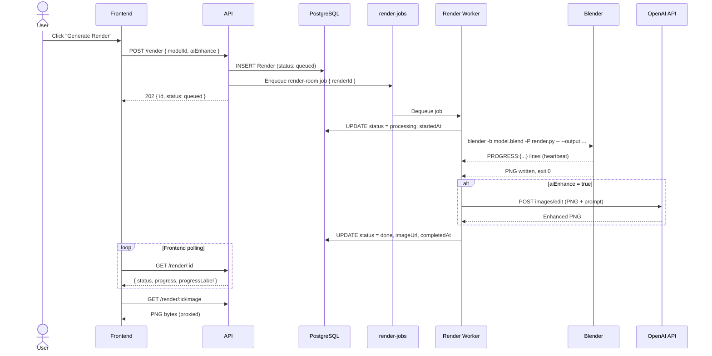

# System Architecture Overview

## Description

This system implements a distributed asynchronous pipeline for 3D model management and rendering. Users upload `.blend` files via the Next.js frontend; the API stores the file in object storage (S3/R2/local volume) and persists metadata to PostgreSQL. Two independent background workers consume from separate Redis-backed queues:

1. **Conversion worker** — exports the uploaded `.blend` to a binary glTF file (`.glb`) using Blender headless, enabling an in-browser Three.js preview.
2. **Render worker** — produces a high-quality PNG using Blender (Cycles or EEVEE), with an optional AI enhancement step via the OpenAI image editing API.

The frontend displays a live rotating 3D preview of each model and a full render history with progress tracking.

---

## High-Level Architecture

---

## Request Lifecycle — Model Upload & 3D Preview

---

## Request Lifecycle — Render Job

---

## Key Architectural Decisions

### Two Independent Queues
GLB conversion (`convert-jobs`) and PNG rendering (`render-jobs`) are handled by separate workers with separate concurrency limits. This ensures heavy renders don't starve the lightweight conversion jobs and vice versa.

### Object Storage with Local Fallback
All assets (`.blend`, `.glb`, `.png`, thumbnails) are stored in S3-compatible object storage (Cloudflare R2, AWS S3, MinIO) when configured. If no storage environment variables are set, the system falls back to a local Docker volume — useful for development.

### API as Proxy for Storage
The API never redirects clients directly to storage URLs. It fetches bytes server-side and forwards them, ensuring CORS headers are always correct regardless of the storage backend's CORS configuration.

### Heartbeat & Stall Detection
The render worker emits a DB heartbeat every 15 seconds while a child process is running. A stall monitor sweeps every 30 seconds and marks any `processing` render with no heartbeat in the last 90 seconds as `stalled`, making it retriable.

### Optional AI Enhancement
When `aiEnhance: true` is set on a render and `OPENAI_API_KEY` is configured, the worker pipes the Blender output PNG through the OpenAI image editing API (`gpt-image-1`) before storing it. The enhancement step is entirely optional — the pipeline functions identically without it.

### Retry Lineage
Failed or stalled renders can be retried via `POST /render/:id/retry`. A new `Render` record is created with `retriedFromId` pointing to the original, preserving full history.
