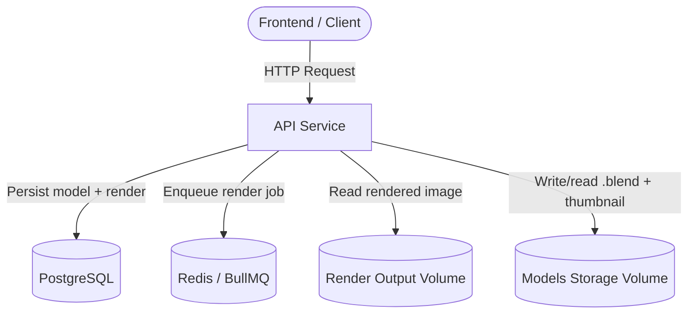
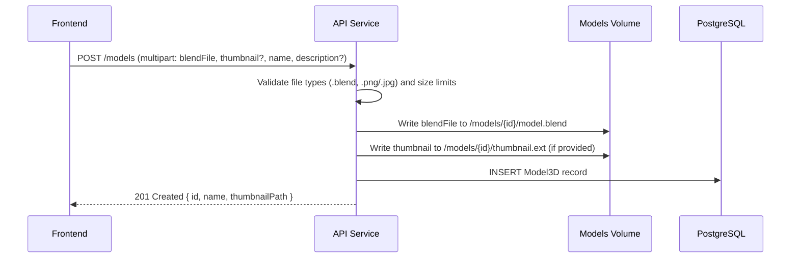
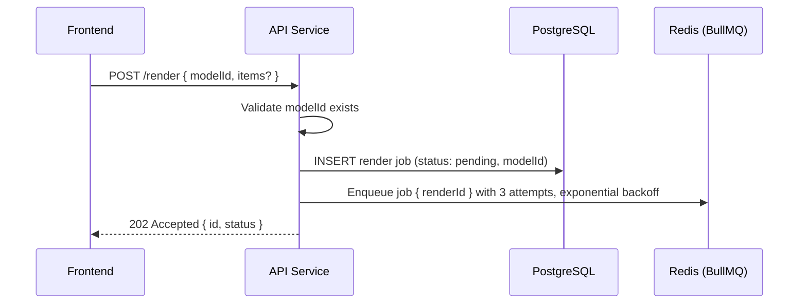

# API Layer (Node.js / Express)

## Overview

The API is the primary entry point of the system, responsible for receiving HTTP requests from the frontend and coordinating all downstream operations. It manages 3D model uploads (`.blend` files + optional thumbnails), validates incoming payloads, persists render jobs and model metadata to PostgreSQL, and enqueues render jobs in Redis via BullMQ for asynchronous processing by the worker. Once a job is complete, the API serves render status and the resulting image back to the client. On first startup, it seeds a default "Chair" model if the database is empty.

---

## Core Responsibilities

- Manage 3D model resources (upload, list, detail, thumbnail serving)
- Validate incoming requests and file uploads before any processing occurs
- Persist render jobs and model metadata in the database
- Enqueue jobs for asynchronous processing by the worker
- Expose endpoints for clients to poll job status and list the render queue
- Serve rendered assets and model thumbnails from shared storage volumes
- Seed default model data on first startup

---

## API Endpoints

| Method | Endpoint               | Description                                      |
| ------ | ---------------------- | ------------------------------------------------ |
| GET    | `/health`              | Health check                                     |
| POST   | `/models`              | Upload a new 3D model (.blend + optional thumbnail) |
| GET    | `/models`              | List all models                                  |
| GET    | `/models/:id`          | Get model details                                |
| GET    | `/models/:id/thumbnail`| Serve model thumbnail image                      |
| POST   | `/render`              | Create a new render job for a model              |
| GET    | `/render/:id`          | Get render job status                            |
| GET    | `/renders`             | List recent renders (last 50, includes model name) |
| GET    | `/render/:id/image`    | Retrieve rendered image                          |

---

## Internal Flow Diagram

How the API interacts with other system components:



---

## Model Upload Flow

Sequence for a `POST /models` request (multipart form upload):



**File validation rules:**
- `.blend` file: required, max 100 MB
- Thumbnail: optional, `.png` / `.jpg` / `.jpeg`, max 5 MB
- Files staged in a temp directory, then moved to `models/{modelId}/` after DB record creation

---

## Render Request Flow

Sequence for a `POST /render` request:



---

## Render Queue Endpoint

`GET /renders` returns the last 50 render jobs with their associated model name. This endpoint powers the frontend's real-time render queue panel:

```json
[
  {
    "id": "uuid",
    "status": "processing",
    "modelId": "uuid",
    "modelName": "Chair",
    "imageUrl": null,
    "createdAt": "2026-04-28T19:48:14.957Z"
  }
]
```

---

## Design Considerations

**Why the API does not process rendering directly**
Rendering is a CPU-intensive, long-running task. Handling it synchronously in the API would block the event loop, degrade throughput, and prevent horizontal scaling of the API tier independently of the rendering workload.

**Why the API returns immediately (async pattern)**
Returning a `jobId` immediately keeps request latency low and makes the system resilient to rendering delays. Clients can poll at their own pace without holding open connections.

**Why polling is used instead of WebSockets**
For this MVP, polling over REST is simpler to implement, debug, and scale. WebSockets introduce additional infrastructure complexity (sticky sessions, connection state) that is not warranted at this stage.

**Why images are served via the API instead of direct storage access**
Routing image retrieval through the API allows for future auth checks, access control, and CDN integration without exposing the raw storage volume to clients.

**Why model files are organized per-model in directories**
Each model gets its own directory (`models/{id}/`) containing `model.blend` and optionally `thumbnail.ext`. This keeps file management simple, avoids name collisions, and makes cleanup straightforward if a model is deleted.
