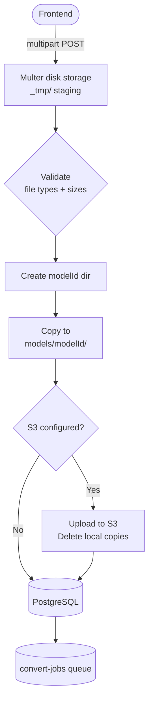
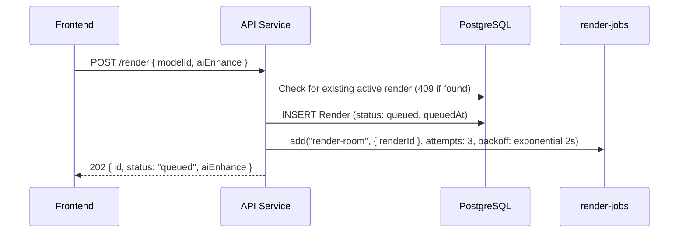

# API Layer (Node.js / Express)

## Overview

The API is the primary entry point of the system. It handles model uploads, render job submission, status polling, and file serving. It validates all incoming data, persists state to PostgreSQL via Prisma, enqueues jobs to Redis (BullMQ), and proxies stored assets back to clients — ensuring CORS-safe delivery regardless of the storage backend.

---

## Core Responsibilities

- Accept and store `.blend` file uploads (and optional thumbnails)
- Dispatch background jobs to two queues: `render-jobs` and `convert-jobs`
- Expose status, progress, and history endpoints for the frontend to poll
- Proxy assets (PNG renders, GLB files, thumbnails) to avoid direct client-to-storage CORS issues
- Seed a default model on first startup if `chair.blend` is present

---

## API Endpoints

### Models

| Method | Endpoint                  | Description                                              |
| ------ | ------------------------- | -------------------------------------------------------- |
| POST   | `/models`                 | Upload a new `.blend` model (multipart: `blendFile`, `thumbnail`, `name`, `description`) |
| GET    | `/models`                 | List all models (id, name, description, thumbnailUrl, createdAt) |
| GET    | `/models/:id`             | Get a single model including `gltfReady` flag            |
| GET    | `/models/:id/thumbnail`   | Serve the model's thumbnail image                        |
| GET    | `/models/:id/gltf`        | Serve the model's `.glb` file (proxied, CORS-safe)       |
| POST   | `/models/:id/convert`     | Re-queue a GLB conversion job (useful if conversion failed) |
| GET    | `/models/:id/renders`     | List renders for a model (filterable by `status`, paginated) |

### Renders

| Method | Endpoint              | Description                                           |
| ------ | --------------------- | ----------------------------------------------------- |
| POST   | `/render`             | Create a new render job (`modelId`, `aiEnhance`)      |
| GET    | `/render/:id`         | Get render job status, progress, and metadata         |
| GET    | `/render/:id/image`   | Serve the rendered PNG (proxied, CORS-safe)           |
| POST   | `/render/:id/retry`   | Retry a `failed` or `stalled` render (creates new record with `retriedFromId`) |
| GET    | `/renders`            | List recent renders (optionally filtered by `modelId`) |

### System

| Method | Endpoint    | Description   |
| ------ | ----------- | ------------- |
| GET    | `/health`   | Health check  |

---

## File Upload Flow (`POST /models`)

- `.blend` files: max 100 MB, stored as `models/{modelId}/model.blend`
- Thumbnails: max 5 MB, stored as `models/{modelId}/thumbnail.{ext}`
- `blendFilePath` in DB stores either an absolute local path or an S3 key (no leading `/`)
- `thumbnailPath` stores either a local path or a full public S3 URL
- After the DB record is created, a `convert-gltf` job is enqueued automatically

---

## Asset Serving (Proxy Pattern)

All file-serving endpoints (`/models/:id/gltf`, `/render/:id/image`, `/models/:id/thumbnail`) proxy bytes through the API rather than redirecting to storage URLs. This guarantees:

- CORS headers are always present (Express `cors()` middleware)
- No client-side dependency on bucket CORS configuration
- Future access-control checks can be added in one place

For local files, `readFile` is used. For S3-hosted files, the API performs a server-side `fetch` of the public URL and streams the response buffer to the client.

---

## Render Submission Flow (`POST /render`)

Only one active render (`queued` or `processing`) is allowed per model at a time. A `409 ACTIVE_RENDER_EXISTS` error is returned with the existing render ID if a duplicate is attempted.

---

## Retry Flow (`POST /render/:id/retry`)

Creates a new `Render` record with `retriedFromId` set to the original ID. Only `failed` or `stalled` renders can be retried. Blocks if the model already has another active render.

---

## Design Considerations

**Why the API proxies storage files rather than redirecting**
A `302` redirect to an S3/R2 URL causes the browser to make a cross-origin request directly to the bucket. Unless the bucket has a permissive CORS policy (which is not always under the operator's control), this fails. Proxying through the API sidesteps CORS entirely and keeps asset access under the API's auth boundary.

**Why uploads go to a temp dir before the model dir**
Multer writes files before the DB record (and `modelId`) exists. Staging to `_tmp/` lets us generate a UUID, create the final directory, and then move files — avoiding naming conflicts and partially-written model directories.

**Why `gltfReady` is a boolean on `GET /models/:id`**
The frontend needs a simple flag to decide whether to render a Three.js viewer or a "not ready" placeholder without needing to attempt a file fetch. The flag is derived from `gltfFilePath != null` at response time.
