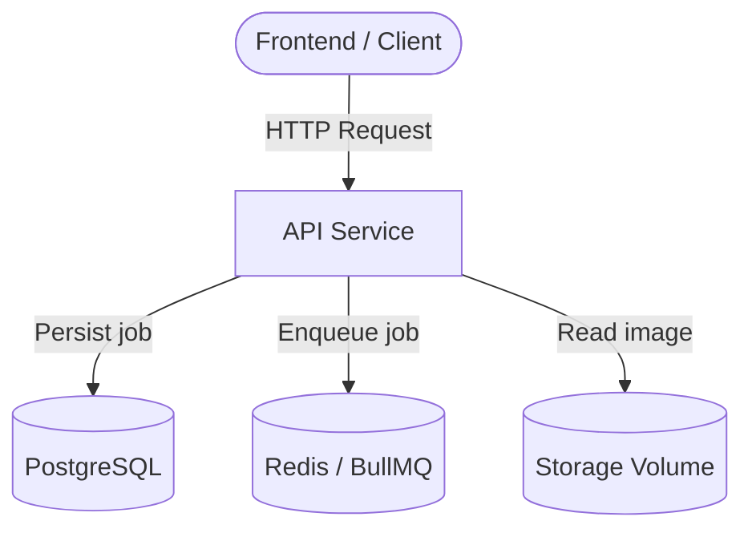
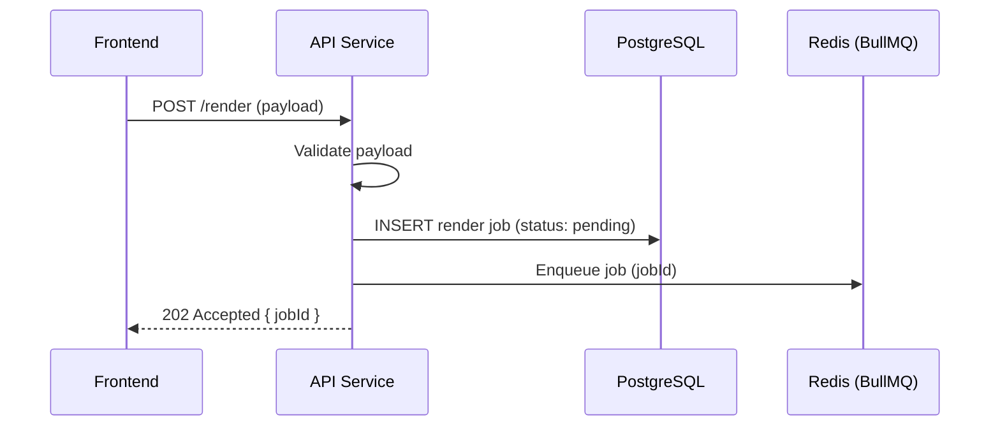

# API Layer (Node.js / Express)

## Overview

The API is the primary entry point of the system, responsible for receiving HTTP requests from the frontend and coordinating all downstream operations. It validates incoming payloads, persists render jobs to PostgreSQL, and enqueues them in Redis via BullMQ for asynchronous processing by the worker. Once a job is complete, the API also serves render status and the resulting image back to the client.

---

## Core Responsibilities

- Validate incoming requests before any processing occurs
- Persist render jobs and their metadata in the database
- Enqueue jobs for asynchronous processing by the worker
- Expose endpoints for clients to poll job status
- Serve rendered assets from the shared storage volume

---

## API Endpoints

| Method | Endpoint            | Description              |
| ------ | ------------------- | ------------------------ |
| POST   | `/render`           | Create a new render job  |
| GET    | `/render/:id`       | Get render job status    |
| GET    | `/render/:id/image` | Retrieve rendered image  |
| GET    | `/health`           | Health check             |

---

## Internal Flow Diagram

How the API interacts with other system components:

---

## Request Handling Flow

Sequence for a `POST /render` request:

---

## Design Considerations

**Why the API does not process rendering directly**
Rendering is a CPU-intensive, long-running task. Handling it synchronously in the API would block the event loop, degrade throughput, and prevent horizontal scaling of the API tier independently of the rendering workload.

**Why the API returns immediately (async pattern)**
Returning a `jobId` immediately keeps request latency low and makes the system resilient to rendering delays. Clients can poll at their own pace without holding open connections.

**Why polling is used instead of WebSockets**
For this MVP, polling over REST is simpler to implement, debug, and scale. WebSockets introduce additional infrastructure complexity (sticky sessions, connection state) that is not warranted at this stage.

**Why images are served via the API instead of direct storage access**
Routing image retrieval through the API allows for future auth checks, access control, and CDN integration without exposing the raw storage volume to clients.
