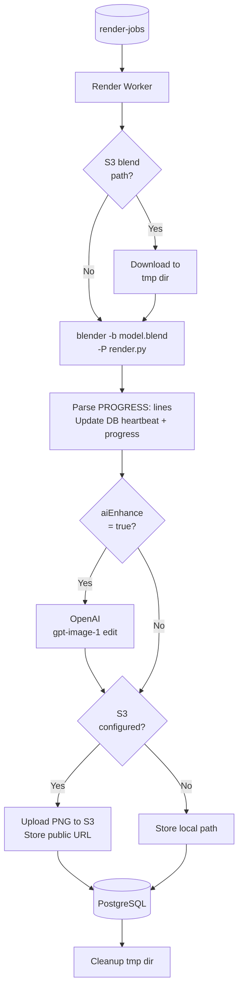
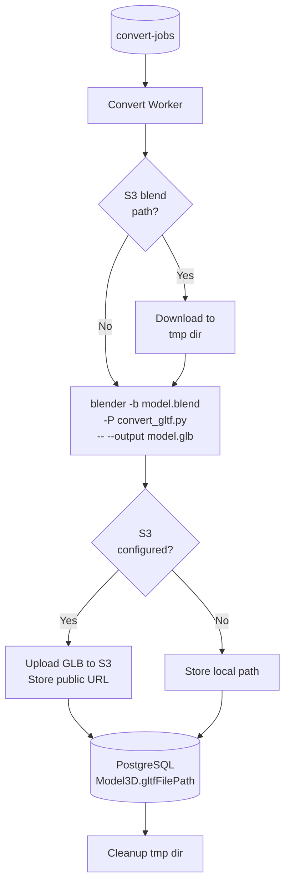

# Worker Layer (Async Processing)

## Overview

The worker is a dedicated background process that runs two independent BullMQ `Worker` instances, each consuming from its own queue:

| Worker         | Queue           | Job          | Concurrency |
| -------------- | --------------- | ------------ | ----------- |
| Render worker  | `render-jobs`   | PNG render   | 2           |
| Convert worker | `convert-jobs`  | GLB export   | 1           |

Both workers share the same Node.js process and interact with PostgreSQL (via Prisma), object storage, and Blender (spawned as a child process). They operate entirely independently of the API.

---

## Render Worker

### Responsibilities

- Consume `render-jobs` from Redis
- Download the `.blend` file from S3 if needed (detected by `isStorageKey()`)
- Spawn Blender in headless mode running `render.py`
- Parse `PROGRESS:` lines from stdout for live progress updates
- Optionally pipe the output PNG through the OpenAI AI enhancement layer
- Upload the result to S3 or keep on local disk
- Update `Render` status in PostgreSQL

### Processing Flow



### AI Enhancement

When `aiEnhance: true` is set on the `Render` record and `OPENAI_API_KEY` is present in the environment, `ai_enhance.py` is called after the Blender render step:

1. Opens the output PNG
2. Sends it to `openai.images.edit()` with a photorealism prompt
3. Receives the enhanced image (base64 or URL)
4. **Overwrites** the original PNG in-place
5. Returns control to the worker, which proceeds with storage upload as normal

The AI step is fully transparent to the rest of the pipeline — the worker only sees a PNG file on disk either way.

---

## Convert Worker

### Responsibilities

- Consume `convert-gltf` jobs from `convert-jobs`
- Download the `.blend` from S3 to a temp dir if needed
- Spawn Blender running `convert_gltf.py` to export a `.glb` file
- Upload the `.glb` to S3 or keep on local disk
- Update `Model3D.gltfFilePath` in PostgreSQL

### Processing Flow



`bpy.ops.export_scene.gltf(filepath=..., export_format='GLB')` is used — available in both Blender 3.x and 4.x. The output is a single binary `.glb` file with meshes, materials, and textures embedded.

---

## Heartbeat & Stall Detection

Long-running renders can become "orphaned" if the worker crashes mid-job. Two mechanisms prevent stale `processing` records:

### Heartbeat

- A `setInterval` running every **15 seconds** updates `Render.lastHeartbeatAt` while the child process is alive
- `PROGRESS:` lines from the renderer also update `lastHeartbeatAt` as a side-effect

### Stall Monitor

- Runs every **30 seconds** via `setInterval`
- Also runs on worker startup (catches orphans from a previous crash)
- Marks any `processing` render with no heartbeat for ≥ **90 seconds** as `stalled` with an error message
- Uses an atomic `updateMany` with a `WHERE lastHeartbeatAt < threshold` clause — safe to run on multiple worker replicas simultaneously

---

## Render Job States

| State        | Description                                                    |
| ------------ | -------------------------------------------------------------- |
| `queued`     | Job created by API, waiting in Redis queue                     |
| `processing` | Worker has picked up the job; Blender is running               |
| `done`       | Rendering complete; `imageUrl` and `completedAt` are set       |
| `failed`     | All retry attempts exhausted; `errorMessage` contains details  |
| `stalled`    | Heartbeat timed out; can be retried via `POST /render/:id/retry` |

---

## Retry Strategy

BullMQ handles retries automatically:

- **Render jobs**: 3 attempts, exponential backoff starting at 2 s
- **Convert jobs**: 2 attempts, exponential backoff starting at 3 s
- On final failure, the worker's `failed` event handler sets `status = failed` and persists the error message to the DB

---

## Progress Reporting

`render.py` emits structured lines to stdout during execution:

```
PROGRESS:{"progress": 30, "stage": "rendering", "message": "Rendering scene..."}
PROGRESS:{"progress": 70, "stage": "render_complete", "message": "Render saved"}
PROGRESS:{"progress": 100, "stage": "done", "message": "All steps complete"}
```

The worker parses these lines and updates `Render.progress`, `Render.progressLabel`, and `Render.lastHeartbeatAt` in real time. The frontend polls `GET /render/:id` and displays the progress bar using these values.

---

## Design Considerations

**Why two workers in one process**
Spinning up a second OS process for conversion would double the memory overhead without benefit. Two `Worker` instances in the same Node.js process share the event loop efficiently and consume independently from their queues.

**Why convert concurrency is 1**
GLB conversion is I/O-bound (file reads + Blender startup). Running two at the same time offers little throughput gain and risks resource contention with active renders.

**Why renders concurrency is 2**
Two parallel renders balance throughput with resource safety. Each Blender process uses one CPU core during Cycles rendering; two concurrent renders use two cores, which fits typical worker container sizing. This is configurable via code.
