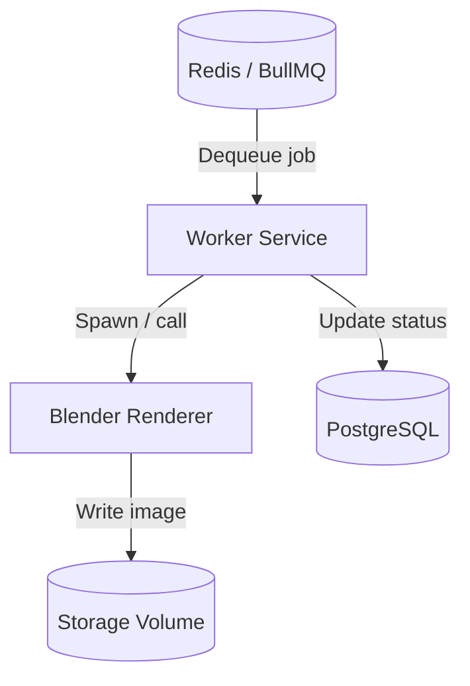

# Worker Layer (Async Processing)

## Overview

The worker is a dedicated background process that consumes render jobs from the Redis queue (BullMQ) and executes them asynchronously. For each job, it invokes Blender in headless mode, which renders the loaded .blend scene and writes the output PNG to the shared storage volume. The worker then updates the job status in PostgreSQL. It operates entirely independently of the API, allowing rendering workloads to scale without affecting request handling.

---

## Core Responsibilities

- Consume jobs from the BullMQ queue
- Execute the rendering process via Blender (headless)
- Handle retries and transient failures automatically
- Update job status in the database at each lifecycle stage
- Log execution flow for observability and debugging

---

## Processing Flow Diagram

---

## Job Lifecycle

Each render job progresses through the following states:

| State        | Description                                              |
| ------------ | -------------------------------------------------------- |
| `pending`    | Job created by API, waiting in the queue                 |
| `processing` | Worker has picked up the job and rendering is in progress |
| `done`       | Rendering completed successfully; image written to storage |
| `failed`     | All retry attempts exhausted; job marked as permanently failed |

> `failed` state is part of the designed lifecycle. Even if full failure handling UI is not yet implemented, the worker marks jobs as failed and preserves the error reason in the database for observability.

---

## Retry Strategy

BullMQ handles retries automatically with configurable options:

- **Attempts**: Each job is retried up to N times before being marked as `failed`.
- **Exponential backoff**: Each retry waits progressively longer (e.g., 1s → 2s → 4s), reducing pressure on downstream services during transient failures.
- **Why it matters**: Rendering can fail due to transient issues (process crash, I/O contention, resource exhaustion). Retrying with backoff gives the system time to recover without manual intervention and avoids thundering herd on restart.

---

## Failure Handling

When a job throws an error:

1. BullMQ catches the exception and marks the attempt as failed.
2. If remaining attempts exist, the job is re-enqueued with a backoff delay.
3. Once all attempts are exhausted, the job is moved to the failed queue and its status is updated to `failed` in the database.
4. The worker process itself does **not** crash — each job runs in an isolated handler; one failure does not affect other jobs in the queue.

This design ensures the worker remains operational even when individual jobs fail repeatedly.

---

## Design Considerations

**Why the worker is a separate process**
Isolating rendering in its own process means crashes, memory spikes, or CPU saturation from rendering do not affect API availability. Each tier can be restarted, scaled, or deployed independently.

**Why rendering is not handled inside the API**
The API uses a non-blocking event loop (Node.js). Running a CPU-bound, long-lived rendering task synchronously would block request handling and destroy throughput under any meaningful load.

**Why async processing is required**
Rendering a 3D scene can take seconds to minutes depending on complexity. Clients cannot wait that long on an open HTTP connection. The async pattern (enqueue → poll) decouples submission latency from processing time.

**How this scales horizontally**
Multiple worker instances can consume from the same BullMQ queue concurrently. BullMQ ensures each job is processed by exactly one worker. Scaling out is a matter of increasing worker replicas — no coordination logic required in application code.
