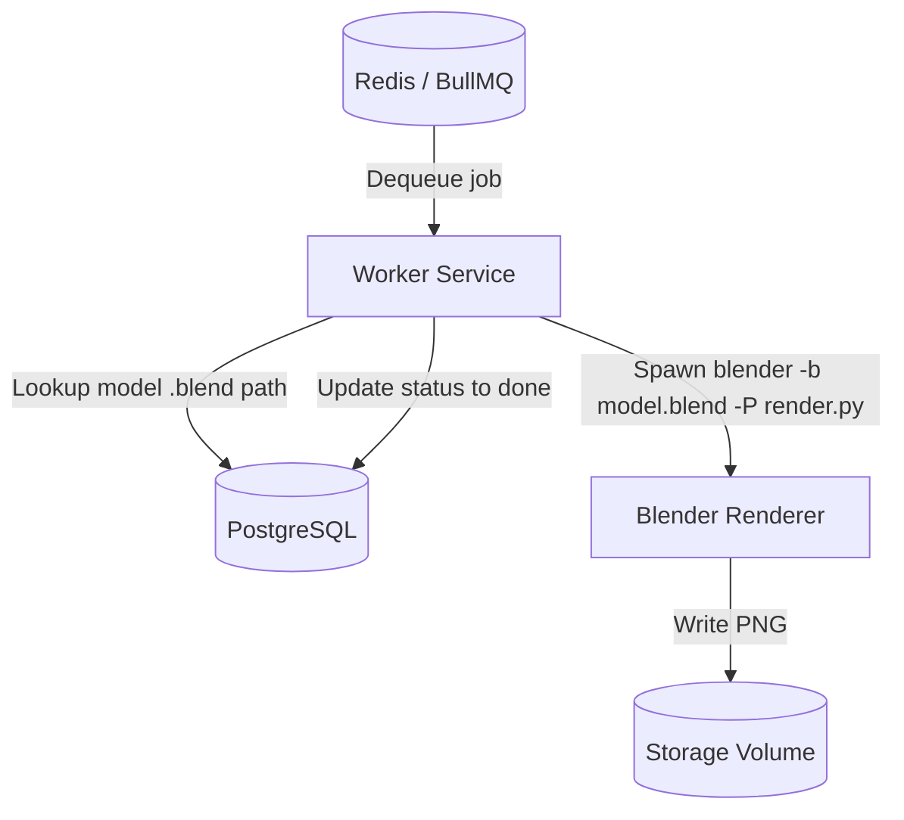

# Worker Layer (Async Processing)

## Overview

The worker is a dedicated background process that consumes render jobs from the Redis queue (BullMQ) and executes them asynchronously. For each job, it resolves the associated model's `.blend` file path from the database, then invokes Blender in headless mode, which renders the loaded scene and writes the output PNG to the shared storage volume. The worker then updates the job status in PostgreSQL. It operates entirely independently of the API, running with a concurrency of 2 (two simultaneous jobs per worker instance), allowing rendering workloads to scale without affecting request handling.

---

## Core Responsibilities

- Consume jobs from the BullMQ queue (queue name: `render-jobs`)
- Resolve the model's `.blend` file path from the database via the `Render → Model3D` relation
- Execute the rendering process by spawning Blender as a child process (headless)
- Handle retries and transient failures automatically (3 attempts, exponential backoff)
- Update job status in the database at each lifecycle stage (`pending` → `processing` → `done`)
- Log structured JSON events for observability and debugging

---

## Processing Flow Diagram



---

## Job Lifecycle

Each render job progresses through the following states:

| State        | Description                                              |
| ------------ | -------------------------------------------------------- |
| `pending`    | Job created by API, waiting in the queue                 |
| `processing` | Worker has picked up the job and rendering is in progress |
| `done`       | Rendering completed successfully; image written to storage |

> On failure after all retry attempts are exhausted, the status is reset to `pending` in the database. There is no separate `failed` enum value in the current schema — the job remains visible in the queue panel for observability.

---

## Blender Invocation

The worker spawns Blender as a child process with the following command structure:

```
blender -b <model.blend> -P render.py -- --output <path>.png --render-id <id> --items <json> --blend-file <path>
```

- `-b`: headless (background) mode
- `-P`: runs `render.py` inside Blender's embedded Python interpreter
- `--` separator: everything after is passed to the Python script as `sys.argv`
- The render script configures the scene (800×600, 32 Cycles samples, denoising disabled for CPU builds) and calls `bpy.ops.render.render(write_still=True)`

If the model has no associated `.blend` file, the worker falls back to the default `chair.blend` bundled in the renderer directory.

---

## Retry Strategy

Each job is enqueued with the following BullMQ retry configuration:

- **Attempts**: 3 (configured at enqueue time in the API)
- **Backoff**: Exponential, starting at 2000ms (2s → 4s → 8s)
- **Why it matters**: Rendering can fail due to transient issues (Blender process crash, I/O contention, resource exhaustion). Retrying with backoff gives the system time to recover without manual intervention and avoids thundering herd on restart.

---

## Failure Handling

When a job throws an error:

1. BullMQ catches the exception and marks the attempt as failed.
2. If remaining attempts exist, the job is re-enqueued with an exponential backoff delay.
3. Once all 3 attempts are exhausted, the worker resets the render status to `pending` in the database, keeping the job visible in the frontend queue panel.
4. The worker process itself does **not** crash — each job runs in an isolated handler; one failure does not affect other jobs in the queue.
5. Every failure is logged as structured JSON with render ID, job ID, error message, and attempt number.

This design ensures the worker remains operational even when individual jobs fail repeatedly.

---

## Concurrency

The worker runs with `concurrency: 2`, meaning a single worker instance processes up to two render jobs simultaneously. This is configured in the BullMQ worker options. To increase throughput:

- Increase concurrency per worker (trades CPU contention for throughput)
- Scale out additional worker replicas (recommended for production)

---

## Design Considerations

**Why the worker is a separate process**
Isolating rendering in its own process means crashes, memory spikes, or CPU saturation from rendering do not affect API availability. Each tier can be restarted, scaled, or deployed independently.

**Why rendering is not handled inside the API**
The API uses a non-blocking event loop (Node.js). Running a CPU-bound, long-lived rendering task synchronously would block request handling and destroy throughput under any meaningful load.

**Why async processing is required**
Rendering a 3D scene can take seconds to minutes depending on complexity. Clients cannot wait that long on an open HTTP connection. The async pattern (enqueue → poll) decouples submission latency from processing time.

**How this scales horizontally**
Multiple worker instances can consume from the same BullMQ queue concurrently. BullMQ ensures each job is processed by exactly one worker. Scaling out is a matter of increasing worker replicas — no coordination logic required in application code.
