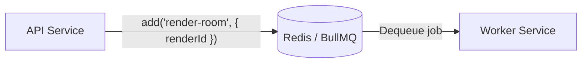

# Queue Layer (Redis / BullMQ)

## Overview

Redis is used as the backing store for the job queue. BullMQ manages the full job lifecycle on top of Redis, providing persistent queuing, retry logic, and state tracking. The API acts as the producer, enqueuing jobs after persisting them to the database. The worker acts as the consumer, picking up jobs and processing them asynchronously.

---

## Core Responsibilities

- Store pending render jobs durably in Redis
- Deliver jobs to available workers in order
- Handle automatic retries on failure with exponential backoff
- Track and expose job state throughout its lifecycle

---

## Queue Configuration

| Setting        | Value                          |
| -------------- | ------------------------------ |
| Queue name     | `render-jobs`                  |
| Job name       | `render-room`                  |
| Payload        | `{ renderId: string }`         |
| Attempts       | 3                              |
| Backoff type   | Exponential                    |
| Backoff delay  | 2000ms (2s → 4s → 8s)         |
| Concurrency    | 2 per worker instance          |

The queue is defined in the shared `@repo/queue` package, which exports the queue name, connection, payload type, and a factory function (`createRenderQueue()`) used by the API to enqueue jobs.

---

## Queue Flow Diagram



---

## Job Payload

The payload is intentionally minimal — only the `renderId` is passed through the queue:

```typescript
type RenderJobPayload = {
  renderId: string;
};
```

All job metadata (model association, items, status) lives in PostgreSQL. The worker uses the `renderId` to look up everything it needs from the database. This keeps the queue payload small and avoids stale data issues if the database record is updated between enqueue and dequeue.

---

## Job Lifecycle in Queue

BullMQ manages jobs through the following states:

| State       | Description                                                   |
| ----------- | ------------------------------------------------------------- |
| `waiting`   | Job has been enqueued and is waiting for an available worker  |
| `active`    | A worker has picked up the job and is currently processing it |
| `completed` | Job finished successfully                                     |
| `failed`    | All 3 retry attempts were exhausted without success           |

Jobs move through these states atomically. BullMQ uses Redis atomic operations to ensure a job is only picked up by one worker at a time.

---

## Retry Behavior

Retry configuration is set per job at enqueue time in the API:

```typescript
await renderQueue.add("render-room", { renderId: render.id }, {
  attempts: 3,
  backoff: { type: "exponential", delay: 2000 },
});
```

- **Attempts**: 3 total tries (1 initial + 2 retries)
- **Backoff**: Exponential starting at 2000ms — delays are 2s, 4s, 8s between retries
- **On final failure**: The worker's `failed` event handler resets the database status to `pending`, keeping the job visible in the frontend queue panel

---

## Design Considerations

**Why Redis was chosen**
Redis provides sub-millisecond latency, built-in persistence options, and atomic list/set operations that make it well-suited as a queue backend. BullMQ is purpose-built on Redis and handles all queue primitives without requiring a separate message broker.

**Why a queue is needed**
Rendering is asynchronous and variable in duration. Without a queue, the system would have no way to buffer incoming jobs during traffic spikes, track their state, or retry failures. The queue acts as a durable handoff point between the API and the worker.

**Why not a direct API → Worker call**
A direct call (HTTP or RPC) would couple availability of the API to availability of the worker. If the worker is down, busy, or restarting, jobs would be lost. The queue decouples producers from consumers: the API can enqueue regardless of worker state, and the worker processes when ready.

**Why the payload is minimal**
Only `renderId` is passed through the queue. This avoids payload bloat, prevents stale data (the worker always reads the latest from the DB), and keeps the queue layer agnostic to business logic changes.
