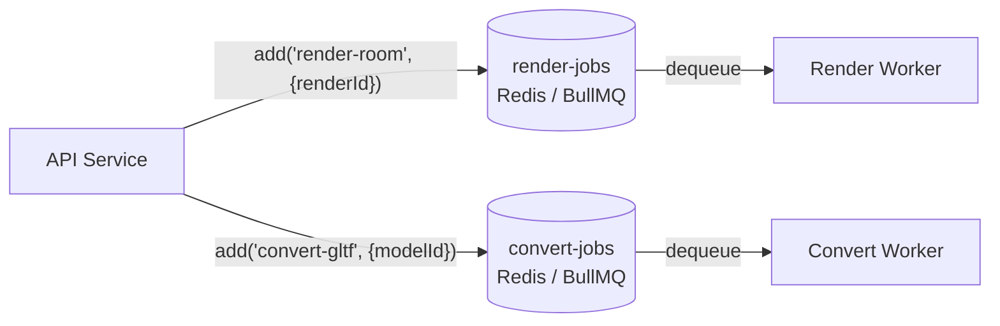

# Queue Layer (Redis / BullMQ)

## Overview

Redis is the backing store for two independent BullMQ queues. The API acts as the producer for both. A single worker process hosts two separate `Worker` instances, each consuming from one queue. The queues are intentionally separate to give each job type its own concurrency setting, retry policy, and failure domain.

---

## Queues

| Queue name      | Producer          | Consumer        | Concurrency | Retries |
| --------------- | ----------------- | --------------- | ----------- | ------- |
| `render-jobs`   | `POST /render`    | Render worker   | 2           | 3, exponential 2 s |
| `convert-jobs`  | `POST /models`, `POST /models/:id/convert` | Convert worker | 1 | 2, exponential 3 s |

---

## Flow Diagram



---

## Job Payloads

```typescript
// render-jobs
type RenderJobPayload = {
  renderId: string; // UUID of the Render record
};

// convert-jobs
type ConvertJobPayload = {
  modelId: string; // UUID of the Model3D record
};
```

---

## Job Lifecycle in BullMQ

Both queues move jobs through the same BullMQ internal states:

| BullMQ state | Description                                                      |
| ------------ | ---------------------------------------------------------------- |
| `waiting`    | Enqueued, waiting for an available worker slot                   |
| `active`     | Worker has claimed the job; lock is held for 300 s (auto-renewed) |
| `completed`  | Handler resolved without throwing                                |
| `failed`     | Handler threw on the final attempt                               |
| `delayed`    | Awaiting backoff delay before the next retry attempt             |

The `lockDuration` for both workers is set to **300 seconds** (5 minutes). BullMQ auto-renews the lock every 150 s while the worker's async handler is still running, preventing false stalls for long Blender processes.

---

## Application-Level Job States

These are distinct from BullMQ's internal states and are tracked in PostgreSQL:

| DB status    | Meaning                                                        |
| ------------ | -------------------------------------------------------------- |
| `queued`     | Record created; BullMQ job enqueued                            |
| `processing` | Worker picked up the job; Blender is running                   |
| `done`       | Render/conversion complete; output stored                      |
| `failed`     | All BullMQ retry attempts exhausted                            |
| `stalled`    | Heartbeat timed out; detected by stall monitor (render jobs only) |

---

## Retry Configuration

### `render-jobs`
```typescript
renderQueue.add("render-room", { renderId }, {
  attempts: 3,
  backoff: { type: "exponential", delay: 2000 },
});
```

### `convert-jobs`
```typescript
convertQueue.add("convert-gltf", { modelId }, {
  attempts: 2,
  backoff: { type: "exponential", delay: 3000 },
});
```

---

## Design Considerations

**Why two separate queues instead of one queue with different job types**
Separate queues allow independent concurrency limits (renders: 2, conversions: 1), independent retry policies, and independent failure domains. A burst of conversion jobs won't consume slots needed for in-progress renders.

**Why Redis / BullMQ**
Redis provides sub-millisecond latency and atomic list operations. BullMQ adds a battle-tested job lifecycle on top, including delayed retries, lock-based deduplication, and event hooks — without requiring a separate message broker.

**Why a queue instead of direct API → Worker calls**
If the worker is down or restarting, HTTP calls would drop jobs silently. A Redis-backed queue persists jobs durably and delivers them when the worker comes back online, with no application-level retry logic needed.
