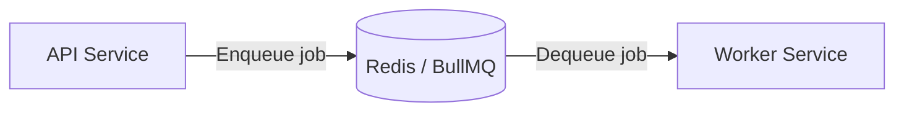

# Queue Layer (Redis / BullMQ)

## Overview

Redis is used as the backing store for the job queue. BullMQ manages the full job lifecycle on top of Redis, providing persistent queuing, retry logic, and state tracking. The API acts as the producer, enqueuing jobs after persisting them to the database. The worker acts as the consumer, picking up jobs and processing them asynchronously.

---

## Core Responsibilities

- Store pending render jobs durably in Redis
- Deliver jobs to available workers in order
- Handle automatic retries on failure
- Track and expose job state throughout its lifecycle

---

## Queue Flow Diagram

---

## Job Lifecycle in Queue

BullMQ manages jobs through the following states:

| State       | Description                                                   |
| ----------- | ------------------------------------------------------------- |
| `waiting`   | Job has been enqueued and is waiting for an available worker  |
| `active`    | A worker has picked up the job and is currently processing it |
| `completed` | Job finished successfully                                     |
| `failed`    | All retry attempts were exhausted without success             |

Jobs move through these states atomically. BullMQ uses Redis atomic operations to ensure a job is only picked up by one worker at a time.

---

## Retry Behavior

BullMQ retry configuration per job:

- **Attempts**: Maximum number of times a job will be tried before being marked `failed`. Configurable per queue or per job.
- **Backoff**: Supports fixed or exponential delay between retries. Exponential backoff increases the wait time after each failure (e.g., 1s → 2s → 4s), reducing load on a recovering system.
- **Delay**: An initial delay can be set before the first attempt or between retries, useful for transient failure scenarios such as a renderer process restarting.

---

## Design Considerations

**Why Redis was chosen**
Redis provides sub-millisecond latency, built-in persistence options, and atomic list/set operations that make it well-suited as a queue backend. BullMQ is purpose-built on Redis and handles all queue primitives without requiring a separate message broker.

**Why a queue is needed**
Rendering is asynchronous and variable in duration. Without a queue, the system would have no way to buffer incoming jobs during traffic spikes, track their state, or retry failures. The queue acts as a durable handoff point between the API and the worker.

**Why not a direct API → Worker call**
A direct call (HTTP or RPC) would couple availability of the API to availability of the worker. If the worker is down, busy, or restarting, jobs would be lost. The queue decouples producers from consumers: the API can enqueue regardless of worker state, and the worker processes when ready.
