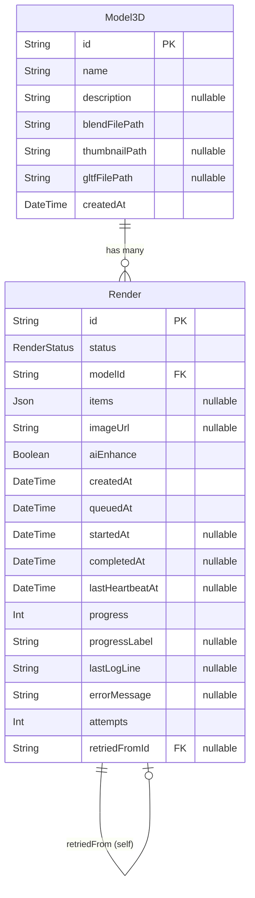

# Database Layer (PostgreSQL)

## Overview

PostgreSQL is the system's source of truth for all persistent state: model metadata, render jobs, and their output locations. All reads and writes go through Prisma ORM. The API creates records; the worker updates them as jobs progress; the frontend reads state back through the API.

---

## Models

### `Model3D`

Represents an uploaded Blender scene.

| Column          | Type              | Description                                                       |
| --------------- | ----------------- | ----------------------------------------------------------------- |
| `id`            | `String` (UUID)   | Primary key                                                       |
| `name`          | `String`          | Human-readable label                                              |
| `description`   | `String?`         | Optional description                                              |
| `blendFilePath` | `String`          | Local absolute path **or** S3 key (e.g. `models/{id}/model.blend`) |
| `thumbnailPath` | `String?`         | Local path, S3 key, or full S3 public URL                         |
| `gltfFilePath`  | `String?`         | Local path or full S3 public URL of the exported `.glb` file. `null` until conversion completes |
| `createdAt`     | `DateTime`        | Record creation timestamp                                         |

> **S3 key detection**: A value without a leading `/` or `http` prefix is treated as an S3 key by `isStorageKey()`. The worker downloads it before use; the API proxies it on read.

---

### `Render`

Represents a single render job for a model.

| Column            | Type              | Description                                                    |
| ----------------- | ----------------- | -------------------------------------------------------------- |
| `id`              | `String` (UUID)   | Primary key                                                    |
| `status`          | `RenderStatus`    | Current job state (see enum below)                             |
| `modelId`         | `String`          | Foreign key → `Model3D.id`                                     |
| `items`           | `Json?`           | Scene configuration payload (array of `{sku, quantity, color}`) |
| `imageUrl`        | `String?`         | Local path or full S3 public URL of the rendered PNG. `null` until done |
| `aiEnhance`       | `Boolean`         | Whether to apply OpenAI post-processing after the Blender render |
| `createdAt`       | `DateTime`        | Record creation timestamp                                      |
| `queuedAt`        | `DateTime`        | When the BullMQ job was enqueued                               |
| `startedAt`       | `DateTime?`       | When the worker picked up the job                              |
| `completedAt`     | `DateTime?`       | When the job finished (success or failure)                     |
| `lastHeartbeatAt` | `DateTime?`       | Updated every 15 s by the worker while the child process runs  |
| `progress`        | `Int`             | 0–100, updated from `PROGRESS:` lines emitted by `render.py`   |
| `progressLabel`   | `String?`         | Human-readable progress stage (e.g. "Rendering scene…")        |
| `lastLogLine`     | `String?`         | Last meaningful stdout line — shown in UI on failure           |
| `errorMessage`    | `String?`         | Error summary, populated on final failure                      |
| `attempts`        | `Int`             | Number of times the worker has attempted this job              |
| `retriedFromId`   | `String?`         | Foreign key → `Render.id` of the original job this retries     |

---

## Status Enum (`RenderStatus`)

```prisma
enum RenderStatus {
  queued
  processing
  done
  failed
  stalled
}
```

| Status       | Set by          | Meaning                                              |
| ------------ | --------------- | ---------------------------------------------------- |
| `queued`     | API             | Record created, BullMQ job enqueued                  |
| `processing` | Worker          | Worker picked up job; Blender is running             |
| `done`       | Worker          | PNG stored; `imageUrl` and `completedAt` are set     |
| `failed`     | Worker          | All retry attempts exhausted; `errorMessage` is set  |
| `stalled`    | Stall monitor   | No heartbeat for 90 s; retriable via `POST /render/:id/retry` |

---

## Relationships



---

## Indexes

```prisma
@@index([modelId, status])       -- fast lookup of active renders per model
@@index([status, lastHeartbeatAt]) -- stall monitor sweep
@@index([createdAt])             -- history pagination
@@index([retriedFromId])         -- retry lineage traversal
```

---

## Role in the System

| Actor          | Operations                                                        |
| -------------- | ----------------------------------------------------------------- |
| API            | `INSERT Model3D` on upload; `INSERT Render` on render request; `SELECT` for status polling and history |
| Render worker  | `UPDATE Render` (status, progress, heartbeat, imageUrl, error)    |
| Convert worker | `UPDATE Model3D.gltfFilePath` on conversion completion            |
| Stall monitor  | `updateMany Render` where heartbeat timed out → `status = stalled` |

---

## Design Considerations

**Why `blendFilePath` / `gltfFilePath` store either a local path or an S3 key**
The system supports two storage modes — local volume and S3-compatible object storage — selected at deploy time via environment variables. Storing raw paths in the DB avoids coupling the schema to a specific storage backend. The application layer (`isStorageKey()`) detects the mode from the value's format.

**Why `items` is a `Json` field**
Scene configuration is a flexible, evolving structure. Keeping it as JSON avoids schema migrations as the input format changes and preserves the full payload for replay or debugging.

**Why job status is tracked in the database and not only in Redis**
Redis queue state is transient. Once a BullMQ job completes or is cleaned up, its state is gone. The database provides a permanent, queryable audit trail of every job — essential for render history, debugging, and the retry lineage chain.

**Why `lastHeartbeatAt` lives on `Render`**
The heartbeat field enables the stall monitor to detect orphaned jobs without polling the child process or BullMQ. It's updated by both the worker's interval timer and by `PROGRESS:` lines from the renderer, giving fine-grained liveness tracking.
