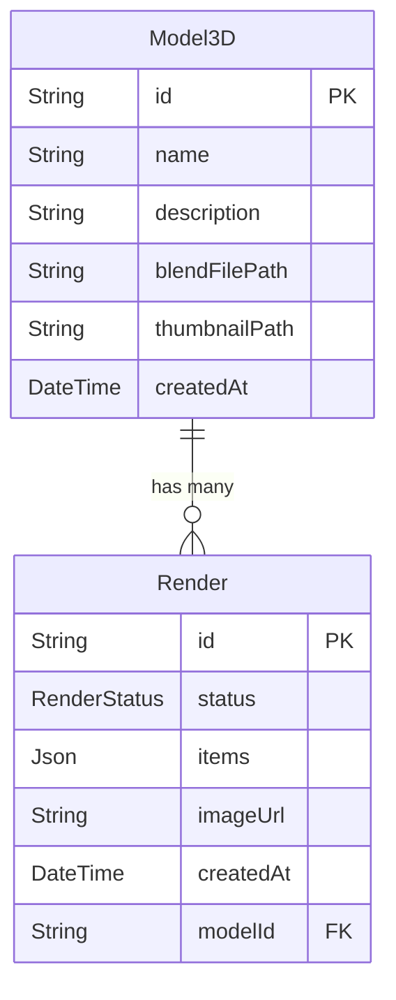

# Database Layer (PostgreSQL)

## Overview

PostgreSQL serves as the system's source of truth for 3D models and render jobs. Every model uploaded by users and every render job created by the API is persisted here. Both the API and the worker interact with the database — the API writes model and render records, the worker updates render status as processing progresses, and the frontend reads state back through the API. The ORM layer is Prisma 6 with a generated client shared via the `@repo/db` package.

---

## Data Model

The database contains two models with a one-to-many relation:

### Model3D

| Column          | Type             | Description                                     |
| --------------- | ---------------- | ----------------------------------------------- |
| `id`            | `String` (UUID)  | Unique identifier for the model                 |
| `name`          | `String`         | Display name of the 3D model                    |
| `description`   | `String?`        | Optional description                            |
| `blendFilePath` | `String`         | Absolute path to the `.blend` file on disk      |
| `thumbnailPath` | `String?`        | Absolute path to the thumbnail image (if uploaded) |
| `createdAt`     | `DateTime`       | Timestamp when the model was created            |

### Render

| Column      | Type             | Description                                        |
| ----------- | ---------------- | -------------------------------------------------- |
| `id`        | `String` (UUID)  | Unique identifier for the render job               |
| `status`    | `RenderStatus`   | Current state of the job (`pending`, `processing`, `done`) |
| `items`     | `Json?`          | Structured input data describing scene parameters  |
| `imageUrl`  | `String?`        | Relative URL to the rendered image (set on completion) |
| `createdAt` | `DateTime`       | Timestamp when the job was created                 |
| `modelId`   | `String` (FK)    | Foreign key referencing `Model3D.id`               |

### Status Enum

```
pending     → Job created, waiting to be picked up
processing  → Worker is actively rendering
done        → Rendering complete, imageUrl is populated
```

---

## Schema Diagram



---

## Role in the System

| Actor    | Operation                                                    |
| -------- | ------------------------------------------------------------ |
| API      | `INSERT` Model3D on `POST /models` (file upload)            |
| API      | `SELECT` models on `GET /models`, `GET /models/:id`         |
| API      | `INSERT` Render with `status: pending` on `POST /render`    |
| API      | `SELECT` renders on `GET /render/:id`, `GET /renders`       |
| Worker   | `SELECT` Render + Model3D to resolve `.blend` file path     |
| Worker   | `UPDATE` status to `processing` when job starts             |
| Worker   | `UPDATE` status to `done` and set `imageUrl` on completion  |
| Worker   | `UPDATE` status to `pending` on final retry failure         |
| Frontend | Reads model list, model details, render status, and queue via API |

The database does not interact directly with the queue or the renderer — all writes go through the API or worker service layer.

---

## Design Considerations

**Why a relational database**
Models and renders have well-defined structure, predictable query patterns (lookup by ID, filter by status, join model name), and transactional requirements. PostgreSQL provides ACID guarantees, ensuring records are never partially written or lost under concurrent access.

**Why `items` is a JSON field**
The scene configuration passed by the frontend is flexible and may evolve without requiring schema migrations. Storing it as `Json` preserves the full input payload for the renderer while keeping the schema stable. It also allows inspection and replay of any job from the database directly.

**Why job status is tracked in the database**
The database is the canonical state store — not the queue. Queue state is transient; the database persists the full job history. Tracking status in the database allows the API to serve accurate status responses even after a job has left the queue, and provides an audit trail for debugging and observability.

**Why Model3D stores file paths, not file contents**
Storing binary blobs (`.blend` files, thumbnails) in the database would bloat it and degrade query performance. Instead, only the absolute file path is stored. The actual files live on Docker-managed volumes shared between the API and worker containers. This keeps the database lean and allows files to be served efficiently via `fs.readFile`.

**Why the Render → Model3D relation exists**
Each render is tied to a specific model. The foreign key allows the worker to resolve which `.blend` file to load, and allows the `GET /renders` endpoint to include the model name in its response without a separate lookup.
