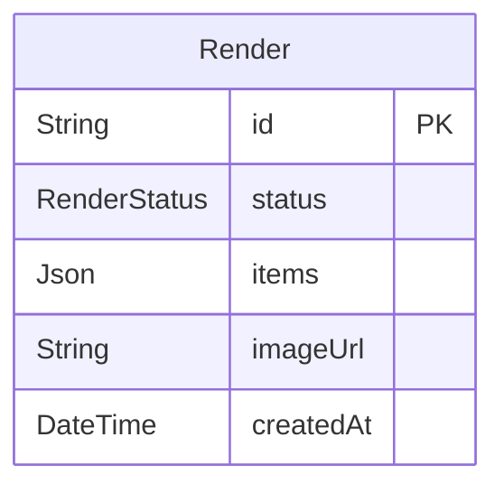

# Database Layer (PostgreSQL)

## Overview

PostgreSQL serves as the system's source of truth for render jobs. Every job created by the API is persisted here with its full metadata and current status. Both the API and the worker interact with the database — the API writes new records, the worker updates them as rendering progresses, and the frontend reads state back through the API.

---

## Data Model

The database contains a single primary model: `Render`.

| Column      | Type          | Description                                        |
| ----------- | ------------- | -------------------------------------------------- |
| `id`        | `String` (UUID) | Unique identifier for the render job             |
| `status`    | `RenderStatus` | Current state of the job (`pending`, `processing`, `done`) |
| `items`     | `Json`        | Structured input data describing the scene to render |
| `imageUrl`  | `String?`     | Path or URL to the rendered image (set on completion) |
| `createdAt` | `DateTime`    | Timestamp when the job was created                 |

### Status Enum

```
pending     → Job created, waiting to be picked up
processing  → Worker is actively rendering
done        → Rendering complete, imageUrl is populated
```

---

## Schema Diagram



---

## Role in the System

| Actor    | Operation                                              |
| -------- | ------------------------------------------------------ |
| API      | `INSERT` new job with `status: pending` on `POST /render` |
| Worker   | `UPDATE` status to `processing` when job starts, then `done` on completion |
| Frontend | Reads job status and `imageUrl` via `GET /render/:id`  |

The database does not interact directly with the queue or the renderer — all writes go through the API or worker service layer.

---

## Design Considerations

**Why a relational database**
Render jobs have well-defined structure, predictable query patterns (lookup by ID, filter by status), and transactional requirements. PostgreSQL provides ACID guarantees, ensuring job records are never partially written or lost under concurrent access.

**Why `items` is a JSON field**
The scene configuration passed by the frontend is flexible and may evolve without requiring schema migrations. Storing it as `Json` preserves the full input payload for the renderer while keeping the schema stable. It also allows inspection and replay of any job from the database directly.

**Why job status is tracked in the database**
The database is the canonical state store — not the queue. Queue state is transient; the database persists the full job history. Tracking status in the database allows the API to serve accurate status responses even after a job has left the queue, and provides an audit trail for debugging and observability.
