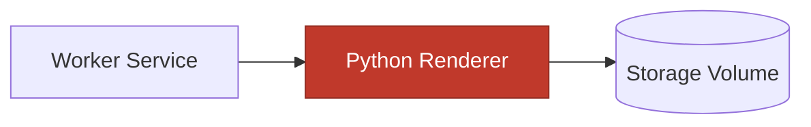
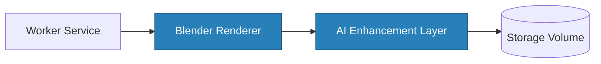
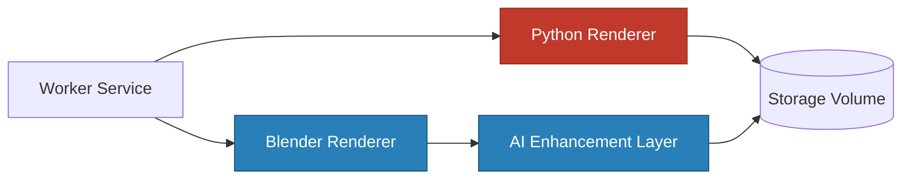

# Future Rendering Pipeline

## Overview

The current system uses a lightweight Python script as a mock renderer, designed to validate the end-to-end async pipeline without the overhead of a real 3D engine. The next evolution integrates Blender as the rendering backend, enabling production-quality 3D scene generation via its Python API (`bpy`). An optional AI enhancement layer can be added after rendering to improve image quality, lighting, or style. Critically, the core architecture — API, queue, worker — requires no changes to support this evolution. Only the rendering step itself is replaced or extended.

---

## Current Pipeline (MVP)

_Current Rendering (Mock)_

---

## Future Pipeline (Enhanced)

_Future Rendering (Blender + AI)_

---

## Combined Comparison

| Color | Meaning              |
| ----- | -------------------- |
| Red   | Current (MVP) path   |
| Blue  | Future additions     |

---

## New Components

### Blender Renderer

- Controlled via Python using the `bpy` module (Blender's scripting API)
- Reads scene configuration from the job payload to generate real 3D geometry
- Produces high-quality renders with accurate lighting and materials
- Runs as a headless subprocess, compatible with the current worker invocation model

### AI Enhancement Layer

- Post-processing step applied to the raw Blender output before writing to storage
- Can improve lighting, sharpen details, upscale resolution, or apply stylistic transfers
- Integrates with external APIs (e.g., Stability AI, Replicate) or local models (e.g., ESRGAN)
- Entirely optional and bypassable — the pipeline still functions without it

---

## Why This Evolution Works

- **No API changes required**: The API contract (`POST /render`, `GET /render/:id`) stays identical.
- **Queue and worker remain unchanged**: The worker still dequeues jobs and invokes a renderer — only the renderer implementation changes.
- **Rendering is an isolated step**: The renderer is a subprocess called by the worker; swapping it out is a configuration and deployment concern, not an architectural one.
- **Extensible by design**: Additional post-processing steps (AI, watermarking, format conversion) can be chained in the rendering pipeline without touching any other layer.
