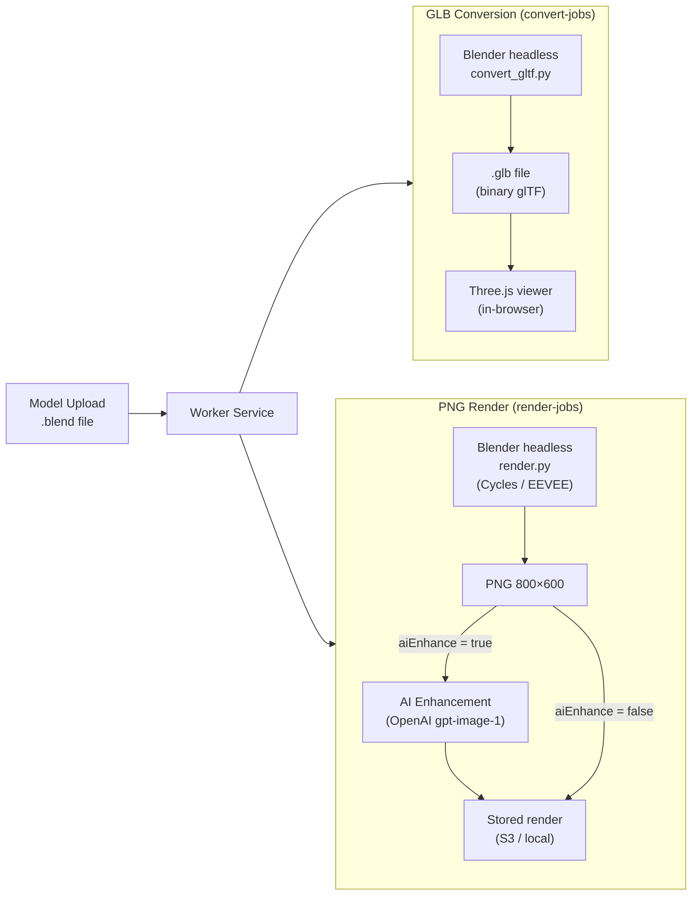
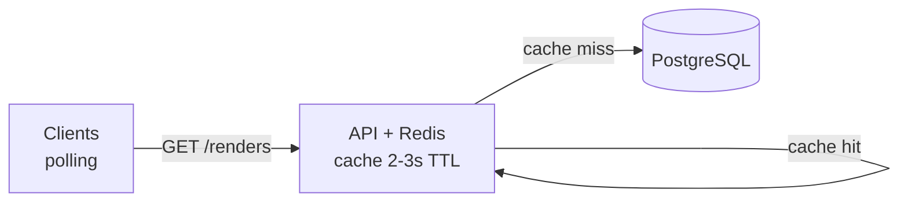
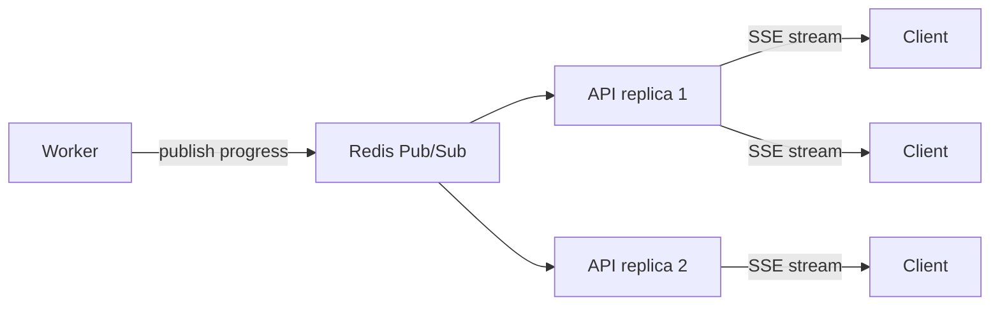

# Rendering Pipeline (Current State & Future Directions)

## Current Pipeline

The rendering pipeline is fully implemented end-to-end. Two parallel paths run after a model is uploaded:



---

## Conversion Path — `.blend` → `.glb`

- Triggered automatically on every model upload via the `convert-jobs` queue
- Can be re-triggered manually via `POST /models/:id/convert`
- Uses `bpy.ops.export_scene.gltf(export_format='GLB')` — available in Blender 3.x and 4.x
- Output: a single binary `.glb` file with geometry, materials, and textures embedded
- Stored in the same directory as the `.blend` (S3: `models/{id}/model.glb`)
- `Model3D.gltfFilePath` is set on completion; the frontend reads `gltfReady` from `GET /models/:id`
- The frontend Three.js viewer uses `GLTFLoader` with a slow auto-rotation; no user interaction

---

## Render Path — `.blend` → PNG

- Triggered on demand via `POST /render`
- Uses Blender headless mode (`-b`) with `render.py` as the Python script
- Default engine: **Cycles** (CPU, 32 samples, no denoising)
- When `aiEnhance = true`: switches to **EEVEE** for the base render, then calls `ai_enhance.py`
- Output: PNG at 800×600px, stored in `services/renderer/output/` or uploaded to S3

### Render engines

| Engine  | Used when                | Characteristics                        |
| ------- | ------------------------ | -------------------------------------- |
| Cycles  | `aiEnhance = false`      | Path-tracing, accurate lighting, slower |
| EEVEE   | `aiEnhance = true`       | Rasterisation, faster, fed to OpenAI   |

### AI Enhancement (`ai_enhance.py`)

- Sends the EEVEE-rendered PNG to `openai.images.edit()` with model `gpt-image-1`
- Prompt instructs the model to improve lighting, add photorealistic textures, and enhance visual quality
- The enhanced image **overwrites** the original PNG before storage upload
- Requires `OPENAI_API_KEY` in the worker environment; skipped silently if absent
- Configurable model via `OPENAI_IMAGE_MODEL` env var (default: `gpt-image-1`)

---

## Progress Reporting

`render.py` emits `PROGRESS:` JSON lines to stdout at key milestones:

```
PROGRESS:{"progress": 10, "stage": "setup",          "message": "Configuring render..."}
PROGRESS:{"progress": 30, "stage": "rendering",       "message": "Rendering scene..."}
PROGRESS:{"progress": 70, "stage": "render_complete", "message": "Render saved"}
PROGRESS:{"progress": 90, "stage": "ai_enhance",      "message": "Applying AI enhancement..."}
PROGRESS:{"progress": 100,"stage": "done",            "message": "All steps complete"}
```

The worker parses these and updates `Render.progress`, `Render.progressLabel`, and `Render.lastHeartbeatAt` in real time. The frontend progress bar reflects these values.

---

## Reliability Features (Implemented)

### Heartbeat & Stall Detection

- Worker updates `Render.lastHeartbeatAt` every **15 seconds** while a child process is alive
- A **stall monitor** runs every 30 seconds, marking renders as `stalled` if no heartbeat for 90s
- Stall monitor also sweeps on worker startup — catches orphans from crashes
- Uses atomic `updateMany` with WHERE clause — safe for multiple worker replicas

### Retry & Lineage

- Failed or stalled renders can be retried via `POST /render/:id/retry`
- Each retry creates a **new Render record** linked via `retriedFromId` — full audit trail
- BullMQ provides automatic retry with exponential backoff (3 attempts for renders, 2 for conversions)

### Adaptive Frontend Polling

The frontend polls `GET /renders` at variable intervals based on queue state:

| Condition | Interval | Rationale |
| --------- | -------- | --------- |
| Any render `processing` | 3s | Near-real-time progress |
| Renders `queued` only | 5s | Less urgent, waiting for worker |
| Browser tab hidden | 15s | Save resources |
| Queue idle (all terminal/empty) | Stopped | No reason to poll |

### Optimistic UI

- Dismissed renders stored in `localStorage`; 10-second undo window via snackbar
- Exit animations on item removal
- Progress bar reflects `Render.progress` and `Render.progressLabel` from DB

---

## Future Directions — Higher Concurrency & Scale

The current polling-based architecture works well for small teams (1–10 concurrent users). Below are the planned improvements to handle high traffic.

---

### Level 1 — Redis Response Cache (target: ~100 concurrent users)



- Cache `GET /renders` response in Redis with a 2–3s TTL
- 100 clients polling every 3s = 33 req/s but only **1 real DB query** per TTL window
- Redis is already in the stack (BullMQ) — zero new infrastructure
- Add **PgBouncer** in transaction mode for connection pooling (100+ effective connections)

---

### Level 2 — Server-Sent Events + Redis Pub/Sub (target: ~1000+ concurrent users)



- Replace frontend polling with **SSE (Server-Sent Events)**
- Workers publish progress updates to Redis Pub/Sub channels (e.g. `render:{id}:progress`)
- API subscribes and fans out to connected SSE clients
- Eliminates N×polling entirely — DB is written to but never polled by clients
- SSE advantages over WebSockets: unidirectional, auto-reconnect, HTTP/2 multiplexing, simpler infra
- Database becomes the **audit log**, not the real-time transport

---

### Level 3 — Horizontal Scaling (target: ~10k+ concurrent users)

- **Read replicas** — Offload any remaining DB reads (render history, model listings)
- **Horizontal API scaling** — Stateless API behind a load balancer; sticky sessions for SSE connections
- **Worker auto-scaling** — Scale worker replicas based on queue depth (Kubernetes HPA or ECS auto-scaling)
- **Rate limiting** — Per-client throttle on render submissions and API calls
- **Queue partitioning** — Shard render queues by tenant or model category for isolation

---

### Level 4 — GPU Rendering & Distributed Workers

- **GPU-enabled workers** — Move Cycles to GPU (CUDA/OptiX) for 10–50× faster renders
- **Spot/preemptible instances** — Use cheap cloud GPU instances for render bursts; BullMQ retries handle preemption
- **Job priority queues** — Premium users get higher priority; BullMQ supports priority natively
- **Regional workers** — Place workers close to S3 buckets to reduce upload latency

---

### Feature Improvements

#### Multi-angle renders
Queue multiple render jobs per model with different camera positions. No schema changes needed — `items` already carries arbitrary scene config. The frontend could display a gallery of angles.

#### WebGL real-time preview improvements
The Three.js viewer currently does a basic auto-rotate with no interaction. Possible improvements:
- Add `OrbitControls` for user interaction
- Add environment maps (HDRI) for reflections
- Support animated models (glTF animation clips)

#### Batch rendering
Accept a list of `modelId`s in a single API call and fan out one render job per model. The queue naturally handles the fan-out; only the API endpoint and optional progress aggregation are new.

#### Background-less / transparent renders
Expose a render option to use a transparent background (EXR/PNG with alpha) for compositing into custom environments on the frontend.

#### Progressive quality
A "fast preview" job (EEVEE, low samples) followed by a "final quality" job (Cycles, high samples) could improve perceived responsiveness. The `retriedFromId` lineage pattern could be reused to link the two jobs.

