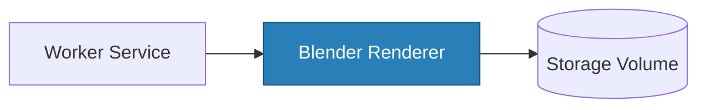
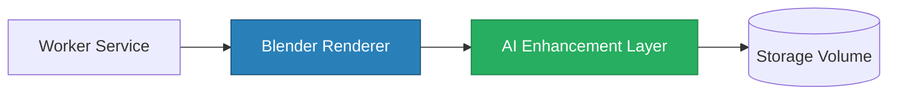

# Future Rendering Pipeline

## Overview

The current system uses Blender in headless mode as the rendering backend, producing production-quality PNG renders from `.blend` scenes via the `bpy` scripting API. The next evolution adds an optional AI enhancement layer after the Blender render step to improve image quality, lighting, or style. Critically, the core architecture — API, queue, worker — requires no changes to support this evolution. Only the post-processing step is added.

---

## Current Pipeline

_Current: Blender headless render → Storage_

---

## Future Pipeline (with AI Enhancement)

_Future: Blender headless render → AI post-processing → Storage_

---

## AI Enhancement Layer

- Post-processing step applied to the raw Blender output before writing to storage
- Can improve lighting, sharpen details, upscale resolution, or apply stylistic transfers
- Integrates with external APIs (e.g., Stability AI, Replicate) or local models (e.g., ESRGAN)
- Entirely optional and bypassable — the pipeline still functions without it

---

## Why This Evolution Works

- **No API changes required**: The API contract (`POST /render`, `GET /render/:id`) stays identical.
- **Queue and worker remain unchanged**: The worker still dequeues jobs and invokes the renderer — only a post-processing step is chained after it.
- **Rendering is an isolated step**: The renderer is a subprocess called by the worker; adding post-processing is a deployment concern, not an architectural one.
- **Extensible by design**: Additional steps (watermarking, format conversion, style transfer) can be chained in the rendering pipeline without touching any other layer.

